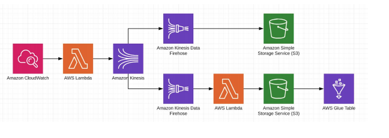

# Punk ML
Previsão do IBU de Cervejas

</img>
## Tabela de Conteudo

1. [Instalação](#installation)
2. [Motivação do Projeto](#motivation)
3. [Arquitetura Funcional](#arquitecture)
4. [Descrição dos arquivos](#files)
5. [Licensa, Autores, e Agradecimentos](#licensing)

## Instalação 
Este código é executado com o Python versão 3.7  e requer algumas bibliotecas, para instalar estas bibliotecas você precisará executar: 
 
` pip install -r requirements.txt `

Para criar o ambiente na Cloud AWS, você precisará ter instalado e configurado:
* Terraform
* AWS Cli

Para realizar a criação do processo de ingestão de dados(Infraestrutura funcional) execute:
 
` sh scripts/create_aws_env.sh `

Para realizar a destruição processo de ingestão de dados(Infraestrutura funcional) execute:
**OBS: Excluir os dados dentro dos buckets antes de executar o comando**
 
` sh scripts/destroy_aws_env.sh `

## Motivação do Projeto 
Realizar a implentação de uma arquitetura completa que consome a <a  href='https://punkapi.com/documentation/v2'>Punk API</a> e também o treinamento de um modelo de machine learning que preve o IBU das Cervejas.

A Punk API possui os dados da cervejaria Brewdog's, é possível realizar pesquisas com diversos tipos de filtros. A API é totalmente gratuita e open source.

## Arquitetura Funcional 

### Ingestão de dados
</img>

Essa arquitetura representa o processo de ingestão e transformação dos dados.

1. Amazon CloudWatch Event é disparado a cada 5 minutos.
2. Uma função lambda faz a coletado dos dados da Punk API.
3. Os dados da função lambda são enviados para Amazon Kinesis Data Stream.
4. O Data Stream dispara para o Amazon Kinesis Data Firehouse que grava os dados brutos em um Storage S3.
5. O Data Stream dispara para outro Amazon Kinesis Data Firehouse, que possui um passo de transformação de dados onde são selecionadas apenas algumas colunas do dado bruto, esse dado transformado então é gravado em um Storage S3 com o formato parquet. Para o acesso a esse dado é utilizado uma Amazon Glue Table.

**OBS: Optei pela utilização de arquivos parquet, pois é um tipo de arquivo que performa muito bem em dados de larga escala e também possui uma forma "nativa" de gravação do Amazon Kinesis Data Firehouse.**
### Machine Learning
Com os dados processados é então treinado um modelo de Machine Learning.
| Algoritimo | Função de Preprocessamento | MAE       | Path        | 
|------------|----------------------------|-----------|--------------------|
| XGBoost    | Simple Imputer             | 20.478275 | model/model.joblib |

## Terraform
A arquitetura de ingestão foi criada de forma que seja reproduzível em outras contas.

## Descrição dos arquivos. 
* **notebooks/data_analisys.ipynb**: Notebook com a Análise de Dados.  
* **notebooks/train.ipynb**: Notebook com a criação do modelo de Machine Learning.  
* **scripts/create_terraform_env.sh**: Cria toda a infraestrutura necessária para a ingestão dos dados na AWS.  
* **scripts/destroy_terraform_env.sh**: Destroi toda a infraestrutura necessária para a ingestão dos dados na AWS.  
* **src/data_prep/cleaned/lambda_function.py**: Função lambda que realiza o processamento/limpeza dos dados.  
* **src/data_prep/raw/lambda_function.py**: Função que realiza a captura dos dados da Punk API.  
* **terraform/cloud_watch.tf**: Arquivo terraform que cria o Cloud Watch Event.  
* **terraform/glue.tf**: Arquivo terraform que cria o banco de dados e tabela no Glue.  
* **terraform/kinesis_firehouse_cleaned.tf**: Arquivo terraform que cria o Kinesis Data Firehouse que executa a função lambda_cleaned que faz o processamento/limpeza dos dados e grava no S3.  
* **terraform/kinesis_firehouse_raw.tf**: Arquivo terraform que cria o Kinesis Data Firehouse que grava os dados brutos no S3.  
* **terraform/kinesis_stream_raw.tf**: Arquivo terraform que cria o Kinesis Data Stream que recebe os dados capturados pela função lambda_raw.  
* **terraform/lambda_cleaned.tf.py**: Arquivo terraform que cria uma função lambda que realiza a transformação/limpeza.  
* **terraform/lambda_raw.tf**: Arquivo terraform que cria uma função lambda que faz a captura dos dados da Punk API.  
* **terraform/policies.tf**: Arquivo terraform que cria as politicas/permissões necessárias para a criação dos serviços.  
* **terraform/s3_bucket_cleaned.tf**: Arquivo terraform que cria o bucket cleaned no S3 Storage.  
* **terraform/s3_bucket_raw.tf**: Arquivo terraform que cria o bucket raw no S3 Storage.  

## Licensa, Autores, e Agradecimentos. 
Fico muito feliz com a realização desse projeto, pois foi um grande desafio utilizar o serviço de Cloud da AWS e fazer com que a arquitetura seja reproduzível utilizando Terraform, ambas são incriveis tecnologias que nos auxiliam muito no processo do desenvolvimento de uma arquitetura de ML completa e robusta.
 
**Eric Buzato Venarusso**